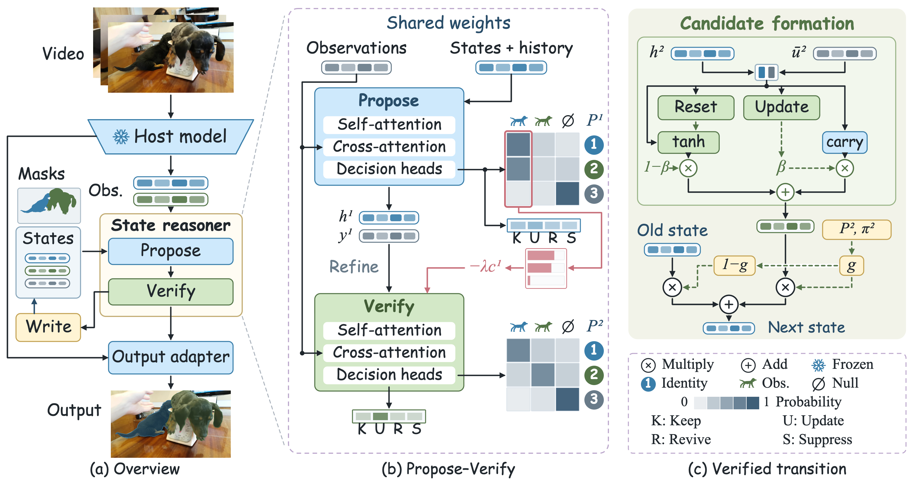
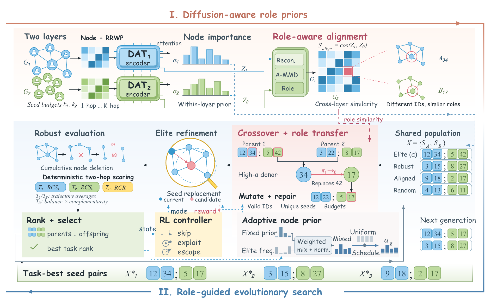
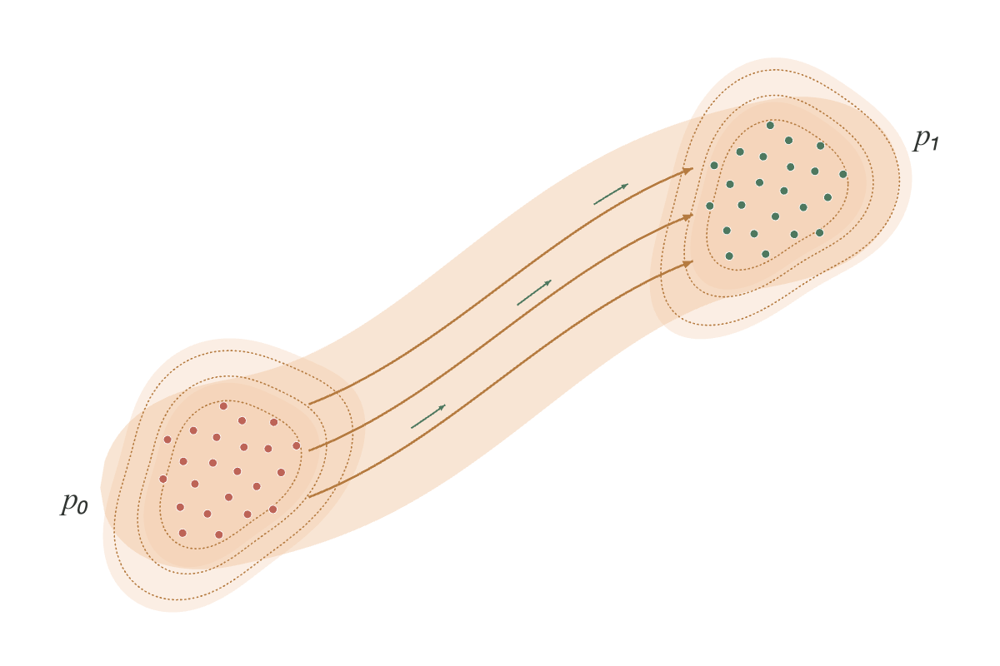
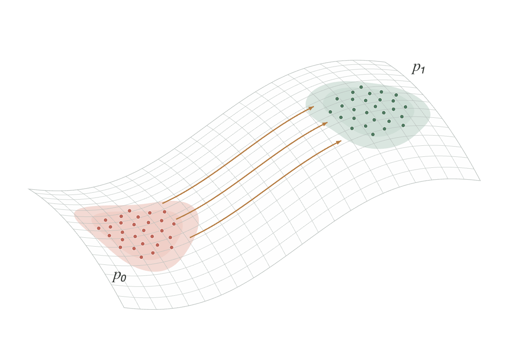
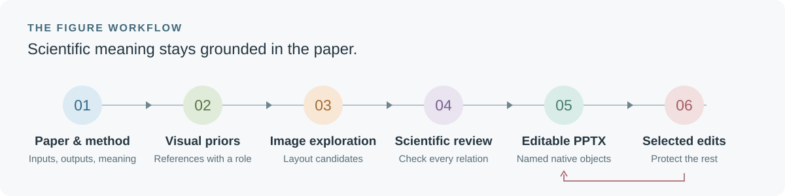
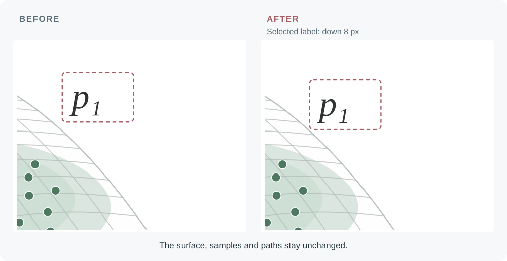

<div align="center">

# Astra Figure Workflow

### 基于论文与视觉参考的可编辑科研绘图工作流

<p>
  
  
  
</p>

[查看 Demo](#demo) · [快速开始](#quickstart) · [局部修改](#selected-edit) · [使用文档](docs/usage.md)

</div>

从已有论文和方法出发，让素材库提供构图、字体与配色参考，结合生图探索，再重建为可编辑的 PPT。后续可以选中具体对象提出修改，保留已经确认的其他部分。

**论文决定科学含义，参考图帮助选择表达方式。** 项目面向 Astra 在 Codex 中协作使用，也要求助手根据当前环境确认可用工具。它不是独立应用，也不把生图到 PPT 的过程包装成无需检查的一键转换。

<a id="demo"></a>

## 完整方法图：论文最终成图

左栏串联视频输入与输出，中栏展开两步推理，右栏展示候选形成与状态写入。保留论文最终图的字体、配色、矩阵及局部细节。



**[下载可编辑 PPT](output/paper-method/method.pptx)** · [矢量图](output/paper-method/method.svg) · [案例与素材来源](examples/paper-method/README.md)

照片与分割覆盖来自 DAVIS 视频及真实标注，仅用于解释方法，不代表模型预测。素材署名及非商业使用限制见案例说明。

## 方法 Overview：角色引导的演化搜索

从双层网络输入、节点重要性与角色对齐，到共享种群、交叉变异、鲁棒评估与种子对输出。Comic 字体、蓝绿分层配色与外围渐变箭头串联两阶段流程。



**[下载可编辑 PPT](output/role-guided-search/overview.pptx)** · [矢量图](output/role-guided-search/overview.svg) · [场景源文件](examples/role-guided-search/overview.scene.json) · [案例说明](examples/role-guided-search/README.md)

这是经多轮局部反馈确认的展示版本：保留 DAT 和损失函数原样，只整理交叉与角色迁移区域。图中 606 个命名元素及连接线均可编辑；节点编号、概率条和种群示例用于解释机制，不是实验结果。原论文全文与私人参考图不随案例公开。

## 空间组件：二维分布与三维网格

下面是工作流制作的实际可编辑示意。下载 PPT 后，标签、样本点、网格与路径均为独立对象。

<table>
<tr>
<th width="50%">二维分布输运</th>
<th width="50%">曲面上的输运</th>
</tr>
<tr>
<td></td>
<td></td>
</tr>
<tr>
<td>用轮廓、样本与路径表达分布变化。</td>
<td>用固定视角的网格与曲面路径表达空间关系。</td>
</tr>
</table>

**[下载两页可编辑 PPT](output/showcase/spatial-flow.pptx)** · [二维场景](examples/showcase/planar.scene.json) · [三维场景](examples/showcase/manifold.scene.json) · [示例说明](examples/showcase/README.md)

这些是通用几何示意，不是实验结果或训练输出。三维图是可编辑的二维投影，不是可旋转的三维模型；分布色块也不代表测量得到的置信区间。原始私人参考不包含在仓库中。

## 绘图流程



| 环节 | 助手需要做出的判断 |
| --- | --- |
| 读懂方法 | 哪条关系是主线，哪些输入、状态与输出不能省略 |
| 选择参考 | 借用哪种构图、字体或配色，哪些内容不能迁移 |
| 探索画法 | 生成候选，用有限文字和明确连线呈现机制 |
| 核对并重建 | 按论文纠正候选，再拆成独立文字、形状和连接 |
| 接收局部反馈 | 定位选中对象，只修改指定范围及必要的关联连线 |
| 检查成品 | 查看实际 PPT 和最终尺寸，保留来源与修改记录 |

已有可编辑图的小改动可以直接进入局部修改，不必每次重新生图。

<a id="selected-edit"></a>

## 局部修改：选中哪里，修改哪里

**演示请求：把三维图右上角的 p₁ 标签下移 8 px，其他部分保持不变。**



这是由修改前后场景生成的局部放大对比，不是模拟软件操作的截图。两份实际 PPT 可下载核对：

[修改前](output/showcase/spatial-flow.pptx) · [修改后](output/showcase/spatial-flow-edited.pptx) · [选区请求](examples/showcase/move-label.json)

- 第一页保持不变，第二页只改变指定标签的位置。
- 标签仍然是文字对象，网格与路径仍可单独编辑。
- 修改后的版本需要重新审阅，不会自动沿用旧版的认可记录。

在支持对象批注的环境中，可以选中 PPT 对象提出要求。通过截图反馈时，助手需要先确认截图对应的对象。项目不自动监听 PowerPoint 选区，也不支持任意手工修改后的 PPT 自动同步回场景文件。

<a id="quickstart"></a>

## 快速开始

将仓库链接、论文和素材路径交给助手：

```text
使用 https://github.com/IamJerryXu/astra-figure-workflow

论文与方法：……
参考素材：……
目标：输入到输出的方法图，少文字，保留必要的数学关系。
风格：Comic / Roman / Modern，或以我提供的参考为准。
交付：可编辑 PPT、预览和场景源文件。
修改时：只改我选中的部分，保留其他已确认区域。
```

继续同一张图时，让助手读取已有绘图记录和当前版本。素材库既可以提供生图先验，也可以提供可复用组件；私人参考默认保留在本地。

<details>
<summary><strong>运行一个不含私人论文的输入准备示例</strong></summary>

```sh
git clone https://github.com/IamJerryXu/astra-figure-workflow.git
cd astra-figure-workflow
python3 scripts/afw.py priors \
  --brief examples/design-brief.json \
  --design examples/design-plan.json \
  --layout stacked \
  --output-dir .local/runs/my-first-figure
```

这一步生成设计提示和输入记录，不会自行调用生图服务。实际生成由助手使用当前可用的图像工具完成。

完整命令、私人素材索引与 PPT 导出说明见 [使用文档](docs/usage.md)。

</details>

## 文档导航

| 想做什么 | 对应文档 |
| --- | --- |
| 把论文方法转成画法 | [构图与视觉叙述](references/art-direction.md) |
| 用素材库提供生图先验 | [参考职责与输入准备](references/design-and-priors.md) |
| 恢复未完成的图，按选区继续修改 | [会话与选区流程](references/workflow-session.md) |
| 调整具体对象并保护其他区域 | [局部编辑规则](references/local-editing.md) |
| 理解源文件及可编辑元素 | [场景格式](references/scene-format.md) |
| 设计网格、向量场和分布图 | [空间表达原则](references/vector-field-priors.md) |
| 核对素材来源与公开范围 | [来源和使用限制](references/provenance.md) |

## 运行条件与边界

Python 辅助脚本以标准库为主。PPT 导出需要 Node.js、`@oai/artifact-tool` 和 Codex 的 Presentations 支持，具体配置见 [环境与依赖](docs/usage.md#环境与依赖)。项目不自动安装这些依赖，也不承诺任意电脑的字体与排版完全一致。

```sh
python3 -m unittest discover -s tests -v
```

自动测试检查文件、版本、选区保护及异常输入，不能替代对科学含义和视觉质量的判断。图中关联连线可按记录随局部编辑更新，但不能保证在 PowerPoint 中任意拖动模块时自动跟随。

公开仓库只包含获准展示的案例，不包含私人论文全文、原始参考库或账户信息。项目目前尚未指定整体开源许可证，第三方素材适用各自条款。

---

<sub>Independent workflow for research-figure authoring. Not an official OpenAI or Microsoft product.</sub>
