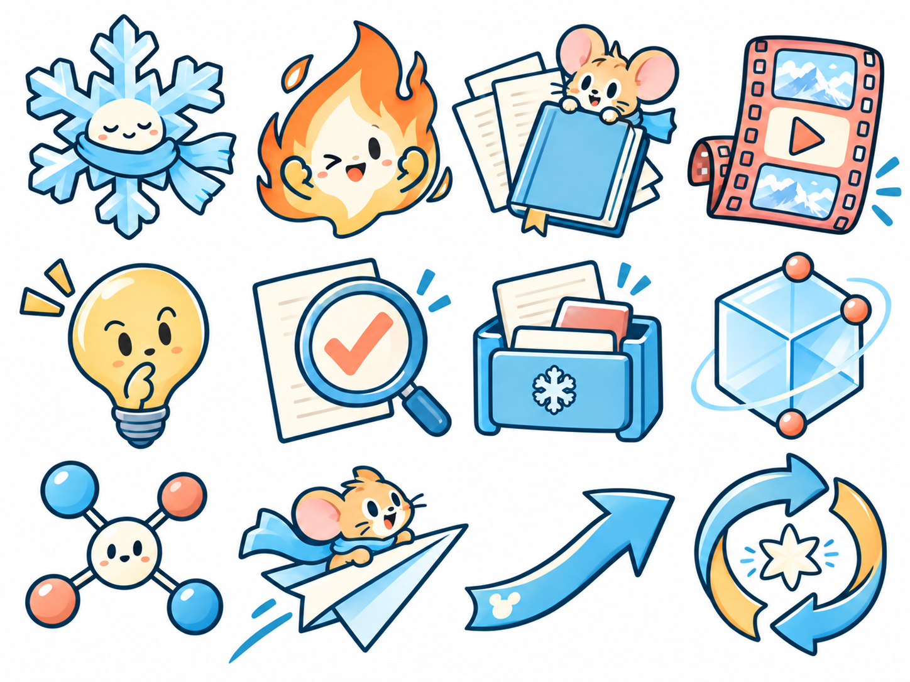
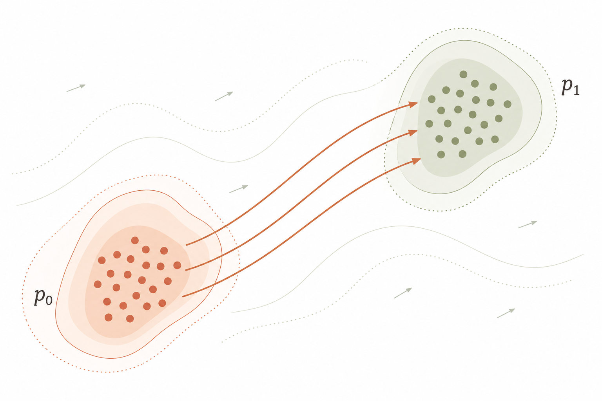
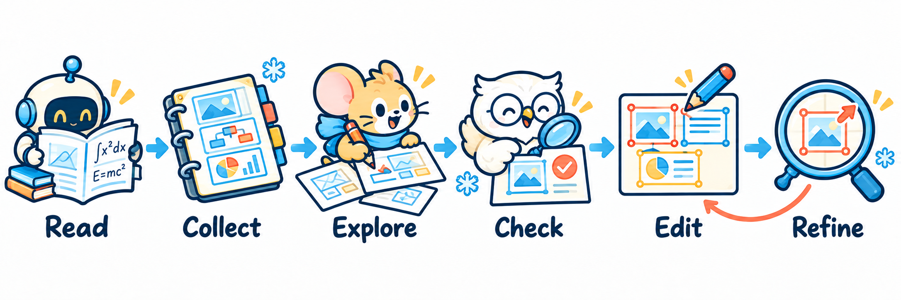

<a id="top"></a>

<div align="center">

<p></p>


<p></p>

<p></p>

<p>
<a href="#demo"></a>
<a href="#kawaii"></a>
<a href="#spatial"></a>
<a href="#quickstart"></a>
<a href="#selected-edit"></a>
</p>

</div>

<p align="center"></p>

所以我们把论文、参考 PPT 和素材库放进同一个工作流，让 Astra 有参考地画，再通过局部修改慢慢调到满意。

把它 git 到本地，连上你自己的素材库，再把论文、方法和喜欢的参考图交给 Astra。构图、配色、生图、做成可编辑 PPT，都可以让它来。你负责看效果、指出哪里不对，不满意就继续改～

没有素材库也没关系，可以从这里公开的素材开始用。我们也可以一起攒：好看的布局、箭头、小图标、网格和曲面，慢慢积累起来，下一张就不用从零想了。

<a id="reference-ppt"></a>

<p></p>

看到其他论文里好看的方法图、框架图，就放进同一个 PPT。整张图可以收，喜欢的图例、箭头和局部放大设计也可以单独留一页。

> **不用整理得很正式，标出你喜欢什么就够了：** 这张的布局、那张的配色、这个图例、这种字体……顺手留下论文标题和链接，之后也方便找回去。
>
> 论文告诉 Astra **方法是什么**，参考 PPT 帮它理解 **你想画成什么样**。素材库不只是贴图仓库，也可以在生图前提供视觉参考。

把本地路径交给 Astra 就好，不需要公开上传。没有自己的库，也可以从下面的素材开始；有愿意分享的组件，欢迎一起攒～

<p align="center"></p>

<a id="demo"></a>

<p></p>


**[PPT](output/paper-method/method.pptx)** · [SVG](output/paper-method/method.svg) · [素材来源与使用限制](examples/paper-method/SOURCES.md)


**[PPT](output/role-guided-search/overview.pptx)** · [SVG](output/role-guided-search/overview.svg) · [源文件](examples/role-guided-search/overview.scene.json)

<a id="kawaii"></a>

<p></p>

科研图也可以可爱一点。小机器人、老师和学生、记忆盒子、视频传送带……一共 48 个，分成四组，挑喜欢的用～

<table>
<tr><th width="50%">基础图标</th><th width="50%">角色与交互</th></tr>
<tr>
<td><a href="output/kawaii/research-icons.png"></a></td>
<td><a href="output/kawaii/roles.png"></a></td>
</tr>
</table>

**[查看全部 48 个图标](output/kawaii/README.md)** · [下载 PNG 素材包](output/kawaii/kawaii-icons.zip) · [方法模块](output/kawaii/modules.png) · [空间与操作](output/kawaii/structures.png)

这组是生图做的白底 PNG 素材页，适合拿来找感觉或做插图。注意：不是已经抠好的透明小图标，也不是可拆开编辑的 PPT / SVG。

<a id="spatial"></a>

<p></p>

分布、网格、曲面、路径这些，不想每次重画。清爽一点，或带一点波纹感，都收在这里了。

<table>
<tr>
<th width="50%">带点波纹的平面</th>
<th width="50%">曲面上的输运</th>
</tr>
<tr>
<td><a href="output/showcase-comic/planar-approved.png"></a></td>
<td></td>
</tr>
<tr>
<td>浅杏色、灰绿和赭色，给平面留一点起伏。<br><a href="output/showcase-comic/planar-ripple.pptx">可编辑 PPT</a> · <a href="output/showcase-comic/planar-ripple-previews/planar-ripple.png">PPT 实际预览</a> · <a href="output/showcase-comic/planar-ripple.svg">SVG</a></td>
<td>用固定视角的网格与曲面路径表达空间关系。<br><a href="output/showcase/spatial-flow.pptx">可编辑 PPT（第 2 页）</a> · <a href="examples/showcase/README.md">示例说明</a></td>
</tr>
</table>

还收了一版清爽的平面：**[看预览](output/showcase/spatial-flow-previews/planar-transport.png)** · [下载 PPT（第 1 页）](output/showcase/spatial-flow.pptx)。文字、点、网格和线都可以分别改。

<details>
<summary><picture></picture></summary>

左边展示的是确认风格的生图原稿；PPT 是按这个方向重新搭出来的可编辑版本，细节不会逐像素相同。[这里能看 PPT 实际预览和说明](examples/showcase-comic/README.md)。不是把整张图片贴进 PPT，就说它可编辑了。

这些是几何示意，不是实验结果；色块也不是测量得到的置信区间。这里的 3D 是固定视角的平面图，能编辑，但不能像三维模型一样转着看。

</details>

<p align="center"></p>

<a id="workflow"></a>

<p></p>



不用一上来就写很长的绘图提示词。给 Astra 看论文，告诉它“我想画从输入到输出的方法图”，再放几张你真正喜欢的参考：这张的配色、那张的布局、另一张的图例。

素材库不只是最后拿来贴几个图标，也是在生图之前帮它理解：**你说的好看，到底是哪一种好看。** Comic、Roman，或者更简洁的风格，都可以有，不必每张图一个模样。

方向满意以后，让它做成可编辑 PPT，把科学关系、箭头、文字和布局一起检查。最后还要缩到论文里的实际大小看一遍——细看精致，不代表整张看着舒服，这个我们踩过坑。

已经有可编辑版本的小改动，就直接改，不用每次重新生图。

<a id="selected-edit"></a>

<p></p>

“这里的线太挤了。”“这个图例换一下。”“把右上角的 p₁ 往下移一点，其他别动。”

不用为了一个小地方推倒整张图。能选中 PPT 对象的时候就直接选中批注，也可以截图圈出来。下面是只移动一个标签的例子：


这是修改前后的局部放大对比，不是操作截图。两份 PPT 也放在这里：

[修改前](output/showcase/spatial-flow.pptx) · [修改后](output/showcase/spatial-flow-edited.pptx) · [选区请求](examples/showcase/move-label.json)

这个例子里，第一页没动，第二页只移了标签，其他对象保持原样。

选中批注需要当前软件支持；用截图时，让 Astra 确认改的是哪个对象。它不会在后台自动读取你在 PowerPoint 里选了什么。如果你手动改过 PPT，也把最新文件给它，别让它接着改旧版。

<a id="quickstart"></a>

<p></p>

可以直接把下面这段发给它，换上你的论文和素材路径：

```text
把 https://github.com/IamJerryXu/AstraDraw git 到本地，
按里面的工作流帮我画一张图。

我的论文 / 方法在：……
我的素材库 / 参考 PPT 在：……
也可以看看仓库里公开的素材。

想要一张从输入到输出的方法图，文字尽量少，方法别画错。
配色和布局参考我给的图，做成可以编辑的 PPT，带上预览。
中间不满意的地方我们再局部改，已经满意的部分别重画～
```

画图和中间的修改都可以交给 Astra，你不用照着一串命令自己跑。素材库给它你愿意开放的本地路径就好，私人材料不用上传到 GitHub。继续上次的图时，把当前版本和修改记录一起给它。

有 token 预算，就多磨几轮～但不用每次推倒重来，越具体的局部反馈，越容易把图改到你想要的样子。

这里是供 Astra 在 Codex 里使用的工作流，不是独立绘图软件。让它检查当前环境能否生图和编辑 PPT；具体用法放在 [使用文档](docs/usage.md)，需要时交给它读就行。

<details>
<summary><picture></picture></summary>

| 想做什么 | 对应文档 |
| --- | --- |
| 把论文方法转成画法 | [构图与视觉叙述](references/art-direction.md) |
| 用素材库提供生图先验 | [参考职责与输入准备](references/design-and-priors.md) |
| 恢复未完成的图，按选区继续修改 | [会话与选区流程](references/workflow-session.md) |
| 调整具体对象并保护其他区域 | [局部编辑规则](references/local-editing.md) |
| 理解源文件及可编辑元素 | [场景格式](references/scene-format.md) |
| 设计网格、向量场和分布图 | [空间表达原则](references/vector-field-priors.md) |
| 核对素材来源与公开范围 | [来源和使用限制](references/provenance.md) |

</details>

<p align="center"></p>

<a id="closing"></a>

<div align="center">


<p></p>

一个好用的箭头、一组小图标、一个漂亮的局部布局，都值得留下。

带上你的素材或新 Demo 来，我们可以合作～

**[来聊聊 / 分享你的图 ↗](https://github.com/IamJerryXu/AstraDraw/issues)** · [回到开头 ↑](#top)

</div>

<details>
<summary><picture></picture></summary>

最后几个小提醒：方法对不对、图好不好看，还是要一起看成品；换电脑后字体和排版可能有差异，PPT 中的连线也不保证随任意拖动自动跟随。[环境说明](docs/usage.md#环境与依赖)留给需要的人。

分享素材前，记得确认自己有权公开，别把未公开论文或私人素材库一起传上来。仓库只放获准展示的案例，没有私人论文全文和原始参考库。目前尚未指定整体开源许可证，第三方素材仍按各自条款使用。[首页插画与字体说明](docs/media/brand/README.md)。

</details>

---

<sub>Independent workflow for research-figure authoring. Not an official OpenAI or Microsoft product.</sub>
