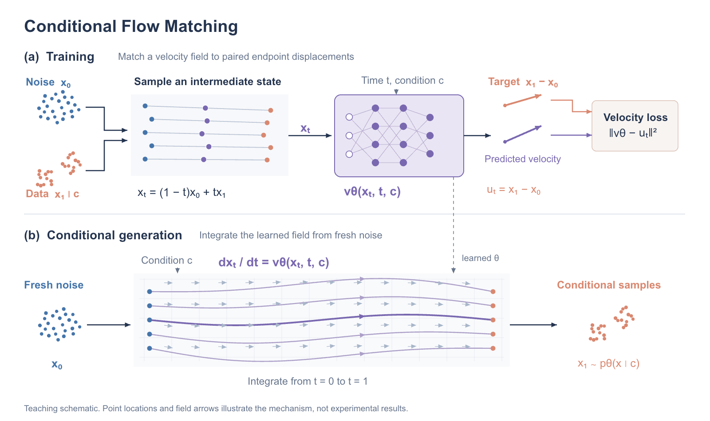

# Conditional Flow Matching framework

An original teaching example with separate training and generation paths. The top
half explains endpoint pairing, intermediate states and velocity supervision. The
bottom half shows conditional generation with the learned field.



[Editable PowerPoint](../../output/framework/conditional-flow.pptx) ·
[SVG](../../output/framework/conditional-flow.svg) ·
[Scene source](conditional-flow.scene.json) ·
[Design rationale](design.md)

Every point, line, network unit, formula and label is a separate native object.
The layered network is an abstract function glyph, not a claimed neural architecture.
Point positions and trajectories are explanatory drawings, not experimental results.

## Scientific scope

For a condition–data pair `(c, x₁)`, draw independent base noise `x₀` and a time
`t ∼ Uniform[0,1]`. The illustrated conditional path is
`xₜ = (1−t)x₀ + tx₁`, with target velocity `uₜ = x₁ − x₀`.
Fit `vθ(xₜ,t,c)` by expected squared error. Generation integrates
`dxₜ/dt = vθ(xₜ,t,c)` from fresh noise.

Training interpolants and learned sampling trajectories are different quantities.
The curved sampling lines illustrate that the latter need not be straight. The
diagram does not claim an SDE, an OT coupling, a particular solver or fitted data.

Scientific references, not copied artwork:

- Lipman et al., [Flow Matching for Generative Modeling](https://arxiv.org/abs/2210.02747), ICLR 2023.
- Tong et al., [Improving and Generalizing Flow-Based Generative Models with Minibatch Optimal Transport](https://arxiv.org/abs/2302.00482). Only the independent conditional-flow formulation informs this teaching example.

The straight-path construction matches the zero-smoothing case discussed in
Section 3.2.2 of Tong et al.: Equations (14)–(15) specify the linear mean and endpoint
displacement, followed by the `σ = 0` connection to Rectified Flow. The explicit
condition `c` is a teaching extension applied to each conditional data distribution.
It is distinct from the endpoint-pair conditioning variable `z` in that section.

All visual content is original. No private library, paper figure, or old ODE font
comparison component appears in this example.

## Rebuild

```sh
node examples/framework/build_scene.mjs --output .local/framework-rebuild/conditional-flow.scene.json
python3 scripts/build_components.py --scene .local/framework-rebuild/conditional-flow.scene.json --output .local/framework-rebuild/conditional-flow.svg
node scripts/export_components.mjs --scene .local/framework-rebuild/conditional-flow.scene.json --output .local/framework-rebuild/conditional-flow.pptx --build-dir .local/framework-rebuild-build
```

The exporter requires the presentation runtime described in the repository's usage
guide and refuses to overwrite existing exports. Choose a fresh output path for a
new revision. The object map links stable object names to the exact PPTX version.
