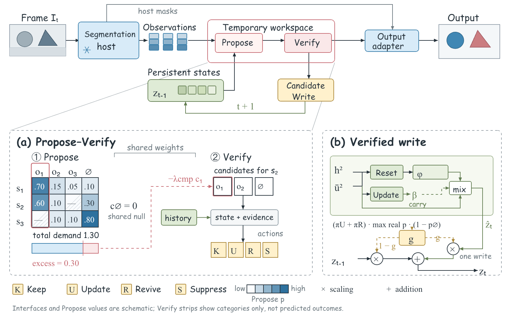

# POSReasoner 方法图

完整的论文方法图示例，包含输入、分割主干、临时推理空间、持久状态与输出，以及 Propose–Verify 和状态写入两个局部展开。论文作者已授权公开此方法图。



[可编辑 PPT](../../output/posreasoner/method.pptx) · [矢量 SVG](../../output/posreasoner/method.svg) · [场景源文件](method.scene.json) · [对象对应表](../../output/posreasoner/method.object-map.json)

## 图中表达

上方展示完整输入到输出路径。Propose 与 Verify 共用参数，在临时空间中完成推理，之后才写入持久状态。左下方展开关联竞争和动作选择，右下方展开候选形成与写入门。灰色放大引线没有箭头，不代表新的计算路径。

图例中的 K、U、R、S 分别表示 Keep、Update、Revive、Suppress。矩阵数字用于解释竞争关系，不是实验结果。Verify 的候选条只表达类别，没有暗示已验证的胜者。

## 公开范围与来源

- 方法结构来自作者的 POSReasoner 稿件。本示例只公开图及可编辑源文件，不包含论文全文。
- 公开版将私人设计中的 DAVIS 帧与标注替换为原创几何示意。输入和输出使用对应形状，均不是照片、数据集标注或模型预测。
- 未重新发布 DAVIS 素材。其随包说明对 CC BY 与 CC BY-NC 存在不同表述，并要求遵守原视频来源条款，因此不将论文图公开许可视作第三方照片的公开许可。[DAVIS 来源页面](https://davischallenge.org/davis2017/code.html)
- 文字、矩阵单元、模块和连线均为独立可编辑对象，预览图并未作为整张图片放进 PPT。字体名称会随文件保存，但字体文件不随仓库分发。精确显示需要本机安装 Comic Sans MS 和 Times New Roman。
- 这是核心机制示意，省略了部分预测分支及主干相关的输出冲突排序。请勿将图中的省略视为完整算法定义。

## 重新导出

在仓库根目录执行。PPT 导出需要项目说明中的 Codex 演示文稿运行环境及 `@oai/artifact-tool`。新输出目录避免覆盖现有示例。

```bash
python3 scripts/build_components.py \
  --scene examples/posreasoner/method.scene.json \
  --output .local/posreasoner-rebuild/method.svg

node scripts/export_components.mjs \
  --scene examples/posreasoner/method.scene.json \
  --output .local/posreasoner-rebuild/method.pptx \
  --build-dir .local/posreasoner-build
```

对象名称保持稳定，可在源文件中定位局部修改。公开对象表使用仓库相对路径，并记录源文件与 PPT 的校验值。
