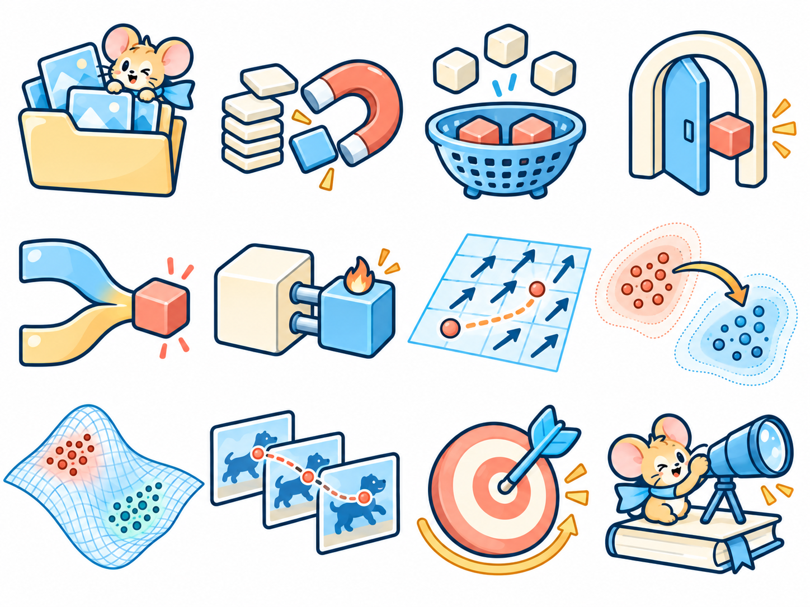

# Kawaii 科研绘图素材

四张素材页，每张包含 12 个图标，共 48 个。点击图片可查看原尺寸。

**[下载全部 PNG](kawaii-icons.zip)**

首页的[欢迎插画](welcome-header.md)也单独放在这里，不计入这 48 个图标。

## 基础图标

## 方法模块

## 空间与操作

## 角色与交互

## 格式与使用范围

- 图像生成工具制作的概念插图，四张原图均为 1448 × 1086 的白底 PNG。
- 这是整页素材预览，不是独立透明图标，也不提供逐对象可编辑的 PPT / SVG。
- 可用于设计探索和图示表达；图中的网格、分布、轨迹与模块是视觉隐喻，不是实验数据或经过验证的方法结构。用于具体论文时需按该论文的含义选择和重绘。
- 公开内容只包含生成结果，不附带私人参考 PPT、网站原图或第三方参考图库。生成图像保留原文件及其中的来源记录。
- 仓库尚未指定整体开源许可证。本页的公开展示不构成第三方权利保证，不代表机构或论文作者背书。
